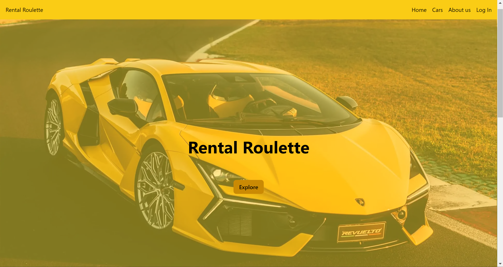

# Welcome to Remix + Vite!

# Rental Roulette

## Project Description

Rental Roulette is a car rental platform that revolutionizes the car rental experience by aggregating prices from a myriad of trusted third-party car rental companies. Nestled in the picturesque landscapes of Ålesund, Rental Roulette takes pride in catering specifically to the vibrant community of this stunning coastal town.



## Getting Started

### Prerequisites

- Node.js >=18.0.0
- Prisma >=5.14.0

### Environment Variables

You need to set the following environment variable in your `.env` file:

- `DATABASE_URL`: The URL to your database. For example: "http://129.241.153.91/api"

### Running the Project

1. Install the dependencies:

```sh
npm install
```

2. Run the development server:

```sh
npm run dev
```

### Building and running in Production

1. Build the project:

```sh
npm run build
```

2. Start the server:

```sh
npm run start
```

### Screenshots
